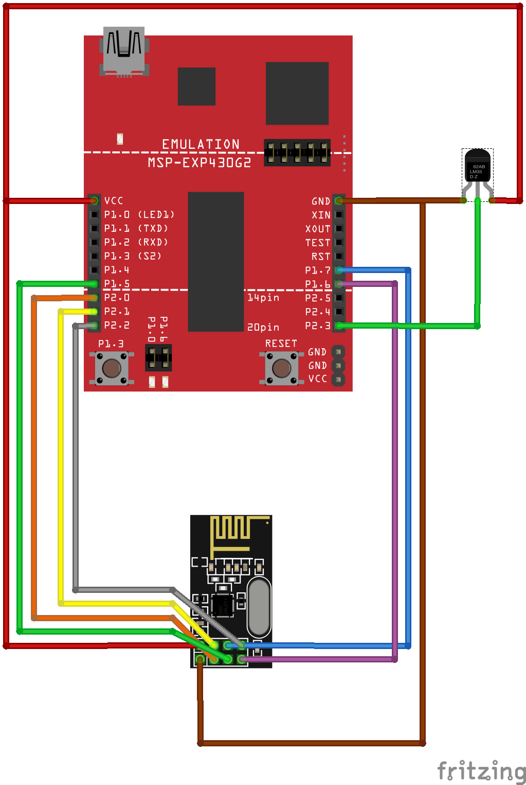

MySensors Port for MSP430 Launchpad
=======

based on MySensors Arduino Library v1.4

# Installation #
see Installation for Arduino

#  Requirenments  #

- Energia 14 and above
- MSP430G2553 mikrocontroller
 
# Example #

mspnodeExample.ino is a sketch example for the Launchpad.

Child ID: 1
Sensors:
- button state
- internal temperature sensor
- supply voltage
- running counter (0-255)

# Wiring #
| Name | Launchpad Pin | NRF Pin |
|---|---|---|
| Gnd | 20 | 1 |
|Vcc (3.3V)|1|2|
|CE|8|3|
|CS|9|4|
|SCK|7|5|
|MOSI|15|6|
|MISO|14|7|
|IRQ|?|8|

## Known Limitations ##
- needs 7.5KB ROM and nearly 220B of RAM
- MSP430G2452 code compiles, but doesn´t run properly - stack corruption possibly
- no Repeater Mode
- no Gateway Mode
- energy saving should work in sleep, but not verified yet
- no EEPROM to save Settings leading to:
- -no AutoID - Id must be set in Setup()
- -fixed to metric
- -unsure how AUTOPARENT behaves

Please visit www.mysensors.org for more information
